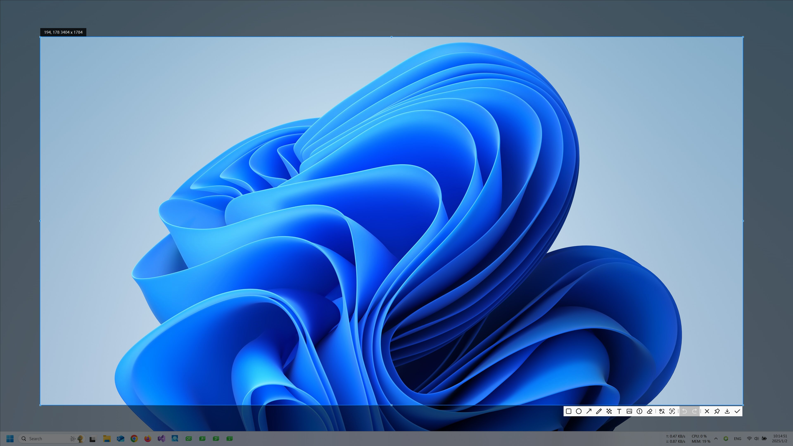
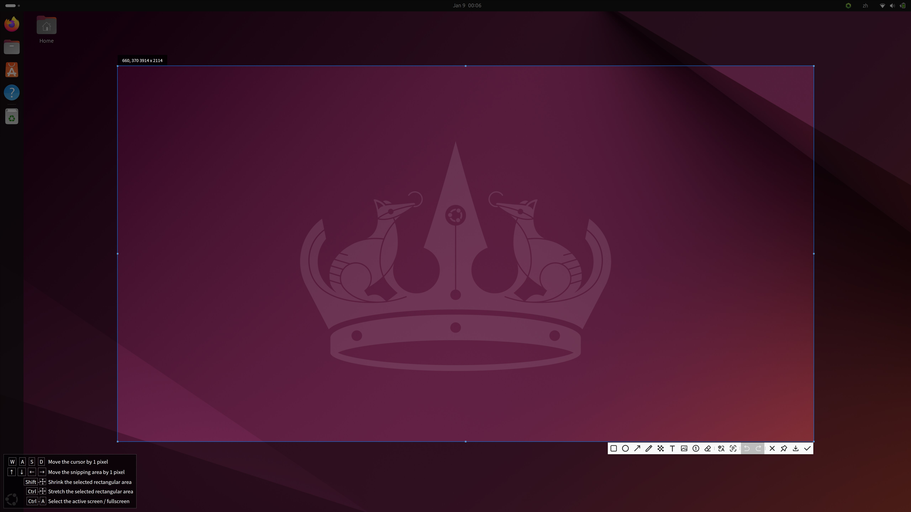
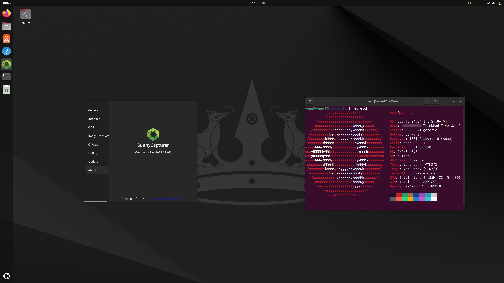
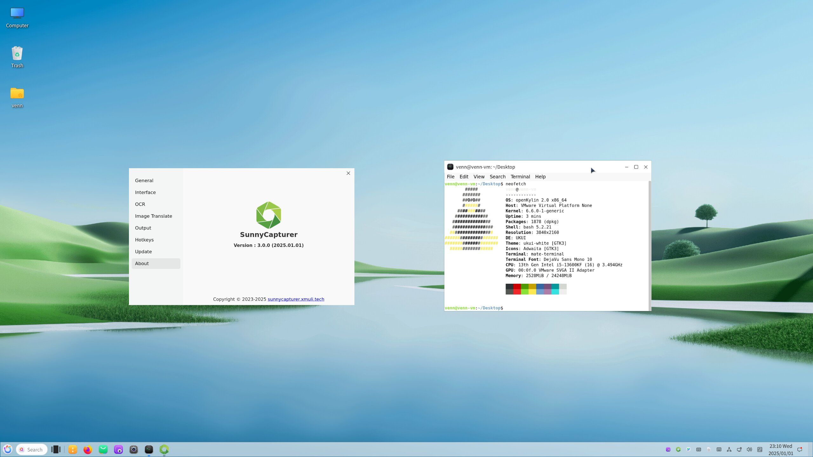
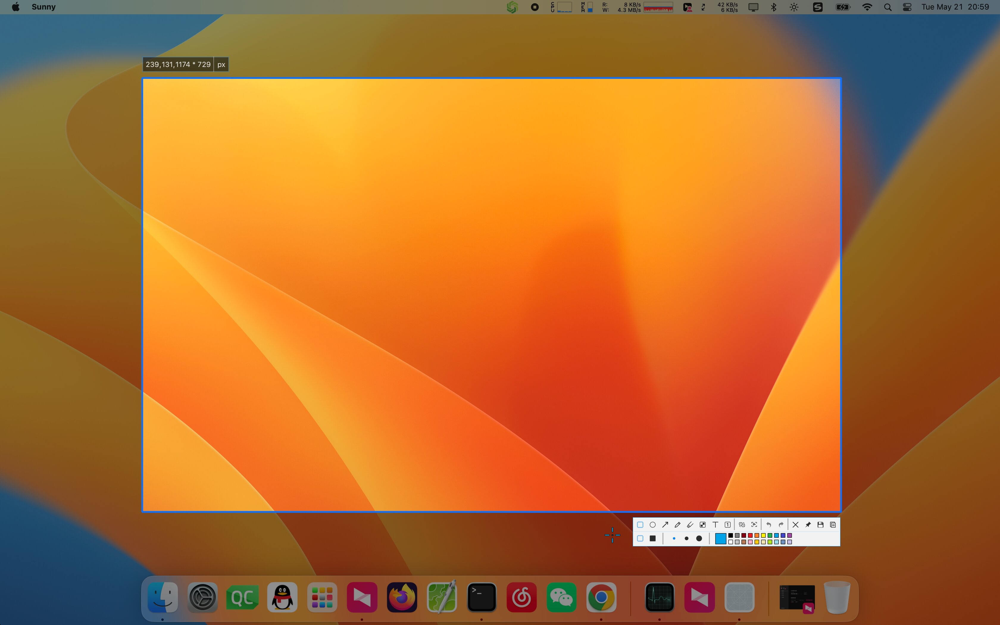
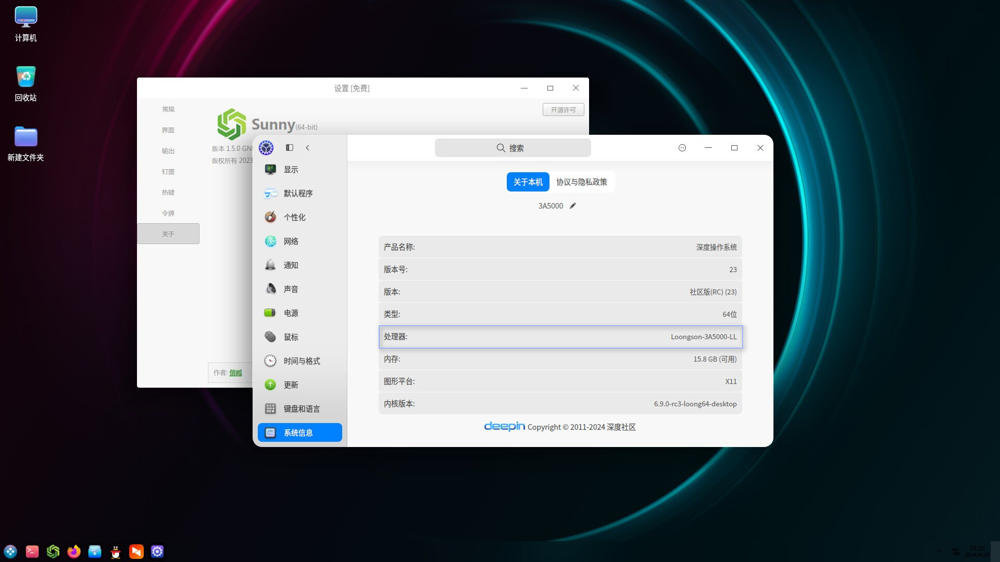

# SunnyCapturer  

     

SunnyCapturer is a simple and beautiful cross-platform screenshot software that supports OCR for extracting text from images, image translation, custom stickers, and pinning images to the screen.

- Official Website & Downloads & User Guide: [http://sunnycapturer.xmuli.tech](http://sunnycapturer.xmuli.tech/)  
- Source Code Repository: [https://github.com/SunnyCapturer](https://github.com/SunnyCapturer)  
- Contribute Translations: [translations](https://github.com/SunnyCapturer/translations)  

- Microsoft Store Download：[SunnyCapturer](https://apps.microsoft.com/detail/9N1TPFK4NCBL)

  

  

# Feedback & Suggestions  

If you encounter any bugs, have improvement suggestions, or wish to propose new features, please check the closed issues first.  

If you don’t find anything similar, feel free to open a new [issue](https://github.com/XMuli/SunnyCapturer/issues) to help track and resolve problems effectively.  

   

# Contact  

                        

   

# Running Demo

?> See [link](./supported_os.md) for details of supported operating system versions

### Windos

 

### Linux:

**Debian12**

 

**Ubuntu20.04-24.04**

 

**Deepin V23**

 

**OpenKylin2.0**

 

### macOS

macos13-15

 

### Linux Deepin V23 （ARM64 & Loongson）:

**Deepin V23 ARM64:**

**Deepin V23 Loongson:**

