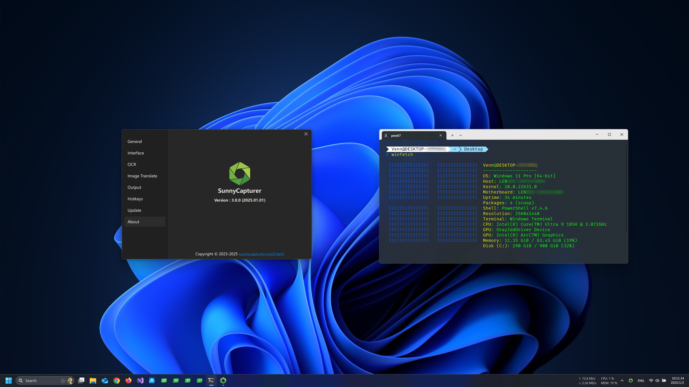
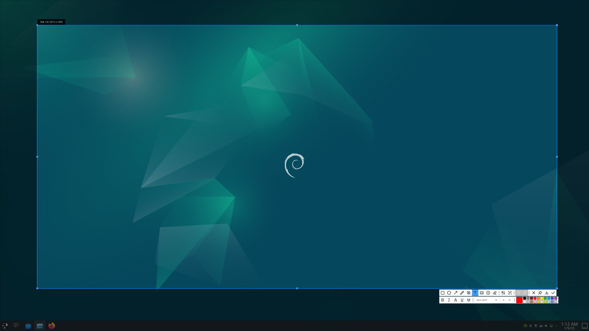
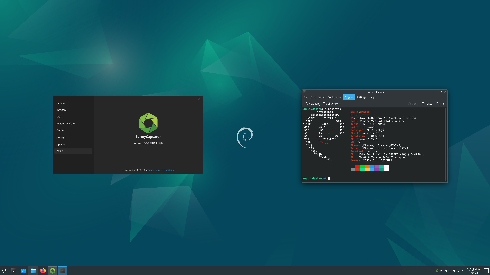
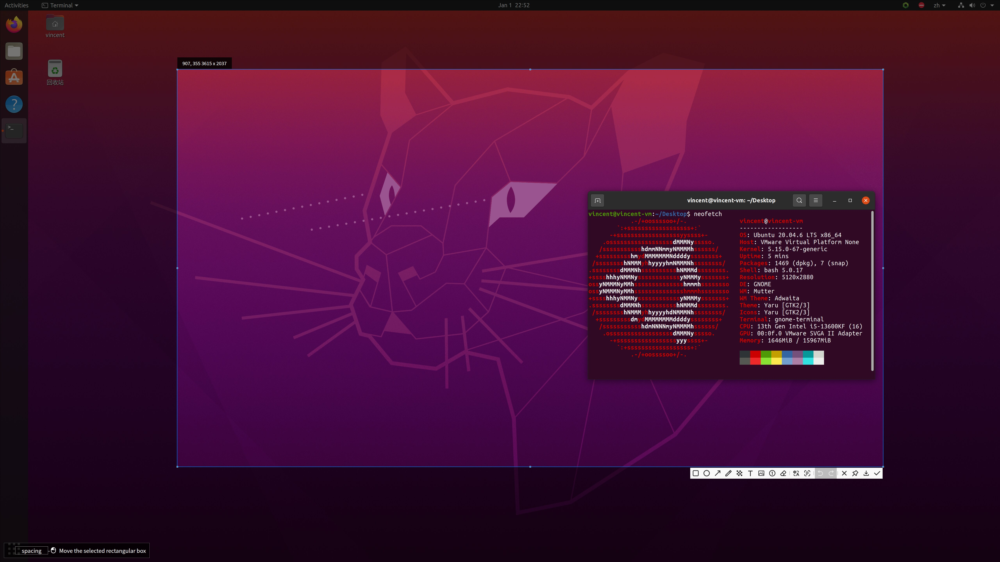
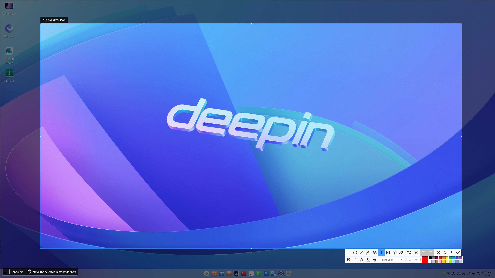
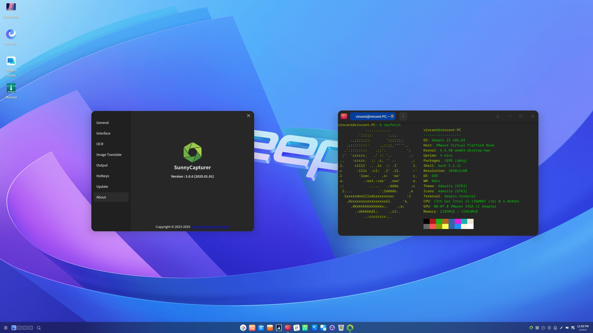
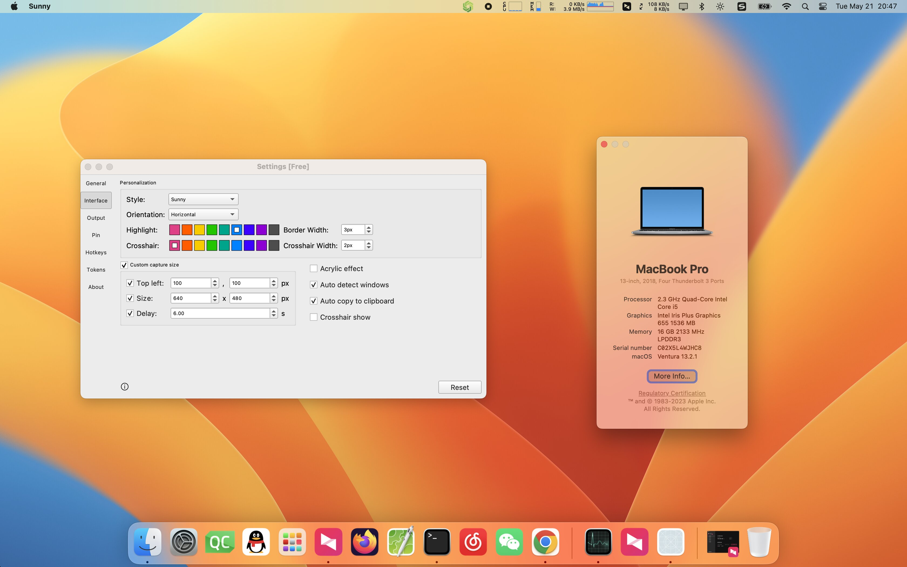
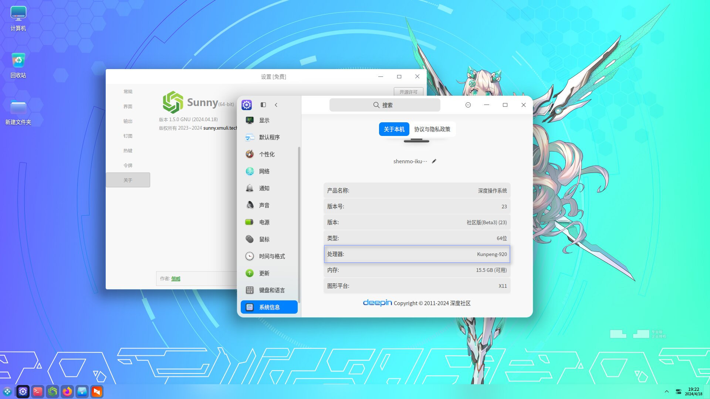

# SunnyCapturer  

     

SunnyCapturer 是一款简单且漂亮的跨平台截图软件工具，支持 OCR 从图片中提取文本、图片翻译、自定义贴图、以及图片钉在屏幕上等功能。

- 官网 & 下载 & 用户手册：[http://sunnycapturer.xmuli.tech](http://sunnycapturer.xmuli.tech/)
- 相关代码开源：[https://github.com/SunnyCapturer](https://github.com/SunnyCapturer)
- 参与翻译：[translations](https://github.com/SunnyCapturer/translations)
- 微软商店下载：[SunnyCapturer](https://apps.microsoft.com/detail/9N1TPFK4NCBL)

   

# 反馈 / 建议

若使用过程中发现任何缺陷 BUG、改进建议、支持的新功能，请先尝试搜索已关闭的 issues，

若没有类似的，请提交一个新的 [issue](https://github.com/XMuli/SunnyCapturer/issues)，便于问题的跟踪及解决。

   

# 联系

                        

   

# 运行效果

?> 详细支持的操作系统版本参考 [这里](./supported_os.md)

### Windos

 

### Linux:

**Debian12**

 

**Ubuntu20.04-24.04**

 

**Deepin V23**

 

**OpenKylin2.0**

 

### macOS

macos13-15

 

### Linux Deepin V23 （ARM64 & Loongson）:

**Deepin V23 ARM64:**

**Deepin V23 Loongson:**

